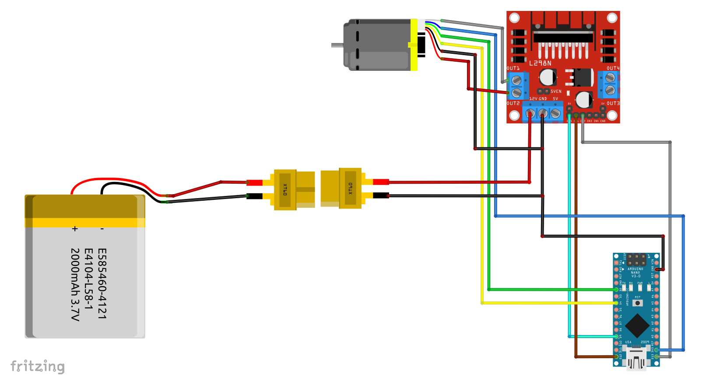
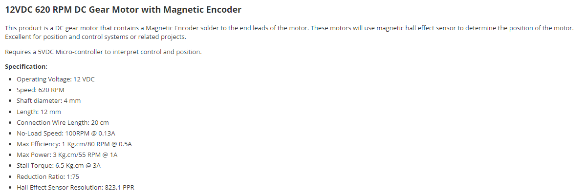

# 모터 속도 계산 설명

## 개요
이 문서는 주어진 모터의 엔코더와 기어비를 기반으로 속도를 계산하는 방법을 설명합니다. 이 계산식을 통해 모터의 RPM(분당 회전수)과 라디안/초(각속도)를 추정할 수 있습니다.

## 회로도



## 사양

## 계산식 설명

### 1. RPM 계산식
엔코더의 펄스(Pulse) 수를 바탕으로 RPM을 계산합니다. 엔코더는 **823.1 PPR(Pulses Per Revolution)** 의 해상도를 가지고 있으며, 모터는 기어비 1:75를 가지고 있습니다.

RPM 계산식:
```
RPM = (encoder_pulses * 60) / (encoder_PPR * gear_ratio)
```

여기서:
- `encoder_pulses`: 주어진 시간 동안 카운트된 엔코더 펄스 수
- `60`: 초당 회전을 분당 회전으로 변환하기 위한 상수
- `encoder_PPR`: 엔코더 해상도 (이 경우 823.1 PPR)
- `gear_ratio`: 모터의 기어비 (이 경우 1:75)

### 2. 라디안/초 계산식
RPM을 각속도(라디안/초)로 변환하는 식입니다. 1 RPM은 0.10472 라디안/초와 같습니다.

각속도 계산식:
```
각속도 = RPM * 0.10472
```

### 3. 코드에서의 적용
Arduino 코드에서의 구현:

```cpp
// RPM 계산
double rpm = (right_encoder_counter * 60.0) / (encoderPPR * gearRatio);

// 라디안/초로 변환
right_wheel_meas_vel = rpm * 0.10472;
```

## 요약
- **RPM 계산**: 엔코더에서 측정된 펄스를 바탕으로 RPM을 계산합니다.
- **라디안/초 계산**: RPM 값을 각속도로 변환하여 모터의 회전 속도를 라디안/초로 출력합니다.

이 계산식은 모터의 기어비와 엔코더 해상도를 기반으로 정확한 속도를 추정하는 데 사용됩니다.
